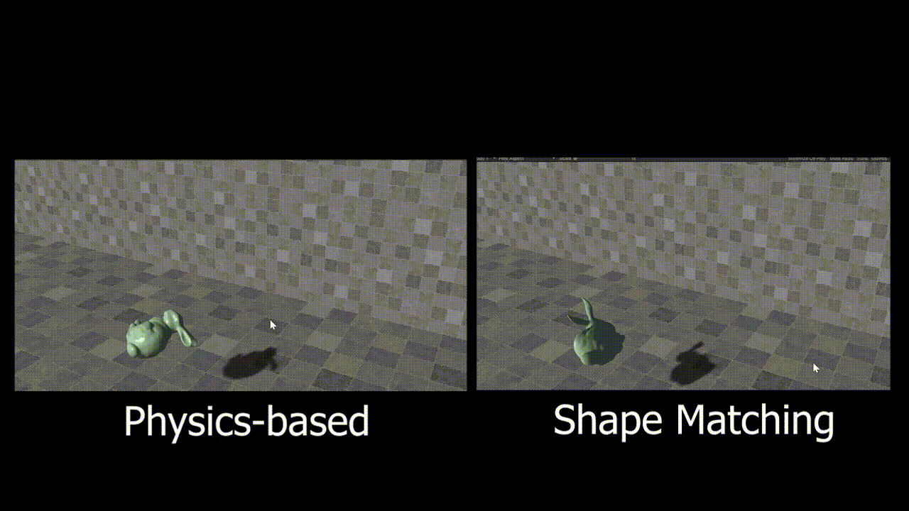

# Physics-based Animation Practice Projects
This repo contains the homework / labs from [GAMES103](http://games103.games-cn.org/) (taught by Dr. Huamin Wang). Files are in the format of unity packages.

# HW1: Angry Bunny
Without using the built-in physics engine in Unity, two simple rigid body dynamics solvers are implemented in this assignment. Physic-based rigid body dynamics solver is in the `assets/scripts/HW1/Rigid_Bunny.cs`, while the shape matching method (non-physics-based) is implemented in the file `assets/scripts/HW1/Rigid_Bunny_by_Shape_Matching.cs`. The rigid body collision detection and response are handled by the impulse method and it is only able to behave correctly colliding with the floor and the wall.

Demo video link: https://youtu.be/N0OpHHo_g_U

## Physics-based Method vs Shape Matching

# HW2: Cloth Simulation

Without using the built-in physics engine in Unity, two simple cloth simulation solvers are implemented in this assignment. Implicit mass-spring system solver with Chebyshev acceleration is implemented in the `assets/scripts/HW2/implicit_model.cs`, while the position-based dynamics with Jacobi fashion  is implemented in the file `assets/scripts/HW2/PBD_model.cs`. The cloth-sphere collision detection and response are with the simple sphere distance model where the distance between the center and vertices of cloth is calculated and adjusted accordingly. This project does not handle cloth self-collision.

## Implicit mass-spring system vs Position-based Dynamics solver

